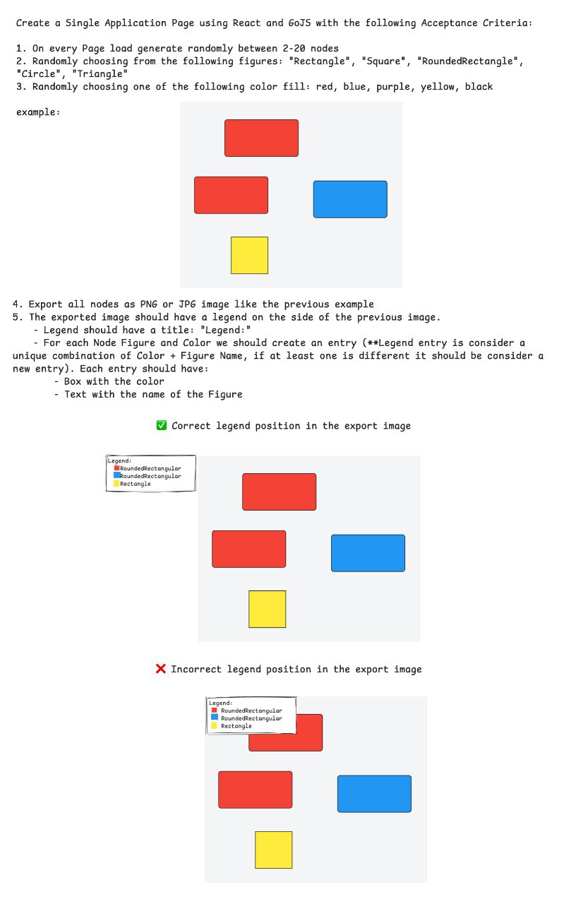

# GoJS React Application



This project is a React application integrated with GoJS for interactive diagrams. It allows you to visualize and export diagrams along with a legend.

## GoJS Integration

### Overview

This application uses GoJS to create and manage interactive diagrams. The diagrams are rendered in a React component, and you can generate, modify, and export them with a legend.

### Key Components

- **Diagram Component:** Handles the rendering and interaction of the GoJS diagram. It allows for dynamic node creation and updates.
- **Legend Component:** Displays a legend corresponding to the nodes in the diagram, including shapes and colors.

### Features

- **Dynamic Node Generation:** Nodes are generated with random shapes and colors.
- **Legend Setup:** Automatically generates a legend based on the nodes in the diagram.
- **Export Functionality:** Allows exporting the diagram along with the legend as a PNG image.

## Checklist for Improvements

1. **User Interface Enhancements:**
   - Add options to customize node appearance and legend layout.
   - Implement zoom and pan controls for better diagram navigation.
   - Enhance responsiveness for various screen sizes and devices.

2. **Functionality Extensions:**
   - Allow users to save diagrams and legends in different formats (e.g., SVG, PDF).
   - Implement undo/redo functionality for diagram modifications.
   - Add support for importing and exporting diagrams to/from external formats.

3. **Performance Optimizations:**
   - Optimize rendering performance for large diagrams with many nodes.
   - Improve the efficiency of legend generation, especially for complex diagrams.

4. **User Experience:**
   - Provide tooltips or contextual help for better user guidance.
   - Add functionality for users to edit node and legend properties directly in the UI.

5. **Testing and Quality Assurance:**
   - Increase test coverage, including unit tests for utility functions and integration tests for components.
   - Perform cross-browser testing to ensure compatibility.

6. **Accessibility Improvements:**
   - Ensure that the application is accessible to users with disabilities (e.g., keyboard navigation, screen reader support).

## Getting Started

### Prerequisites

- Node.js (>= 14.x)
- npm (>= 6.x) or yarn (>= 1.x)

### Installation

1. **Clone the Repository:**

   ```bash
   git clone https://github.com/yourusername/your-repo.git
   cd your-repo
   ```

2. **Install Dependencies:**

   ```bash
   npm install
   # or
   yarn install
   ```

### Available Scripts

In the project directory, you can run:

#### `npm start`

Runs the app in development mode.\
Open [http://localhost:3000](http://localhost:3000) to view it in the browser.\
The page will reload if you make edits. You will also see any lint errors in the console.

#### `npm test`

Launches the test runner in interactive watch mode.\
See the section about [running tests](https://facebook.github.io/create-react-app/docs/running-tests) for more information.

#### `npm run build`

Builds the app for production to the `build` folder.\
It correctly bundles React in production mode and optimizes the build for the best performance.\
The build is minified and the filenames include the hashes. Your app is ready to be deployed!

See the section about [deployment](https://facebook.github.io/create-react-app/docs/deployment) for more information.

#### `npm run eject`

**Note: this is a one-way operation. Once you `eject`, you can’t go back!**

If you aren’t satisfied with the build tool and configuration choices, you can `eject` at any time. This command will remove the single build dependency from your project. Instead, it will copy all the configuration files and the transitive dependencies (webpack, Babel, ESLint, etc.) right into your project so you have full control over them. All of the commands except `eject` will still work, but they will point to the copied scripts so you can tweak them. At this point, you’re on your own.

You don’t have to ever use `eject`. The curated feature set is suitable for small and middle deployments, and you shouldn’t feel obligated to use this feature. However, we understand that this tool wouldn’t be useful if you couldn’t customize it when you are ready for it.

## Usage

1. **Run the Application:**

   ```bash
   npm start
   # or
   yarn start
   ```

   Visit [http://localhost:3000](http://localhost:3000) to see the application in action.

2. **Generating Nodes:**

   Nodes are created dynamically. You can adjust the `generateNodes` function in `generateUtils.ts` to customize node generation.

3. **Exporting Diagrams:**

   Use the `exportWithLegend` function from `utils/exportUtils.ts` to export the diagram and legend as a PNG file.

## Code Structure

- `src/components/Diagram.tsx`: Contains the React component for rendering the GoJS diagram.
- `src/components/Legend.tsx`: Contains the React component for displaying the legend.
- `src/utils/generateUtils.ts`: Utility functions for generating nodes and setting up the legend.
- `src/utils/exportUtils.ts`: Utility functions for exporting the diagram with the legend.

## Learn More

- **GoJS Documentation:** [GoJS Overview](https://gojs.net/latest/intro.html)
- **React Documentation:** [React Overview](https://reactjs.org/docs/getting-started.html)
- **Create React App Documentation:** [Create React App Overview](https://facebook.github.io/create-react-app/docs/getting-started)

Feel free to open an issue or submit a pull request if you have any questions or suggestions!